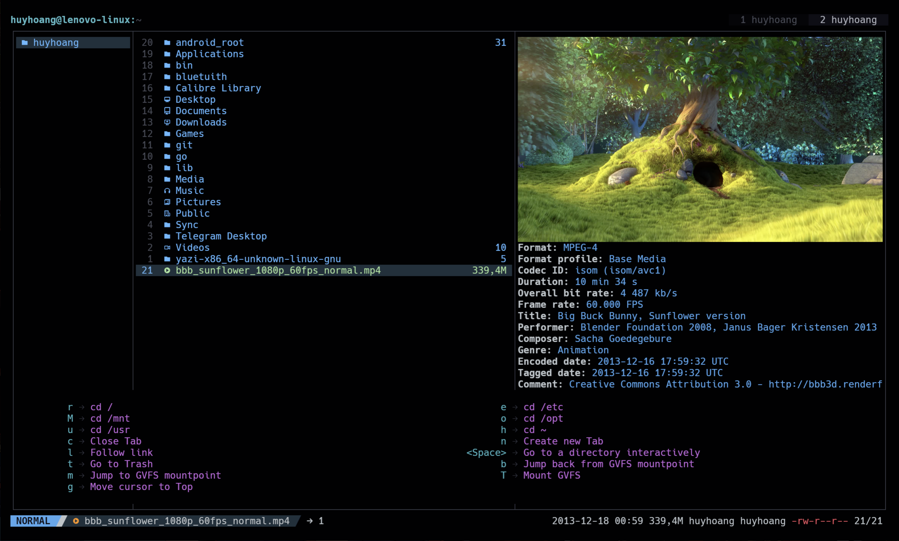
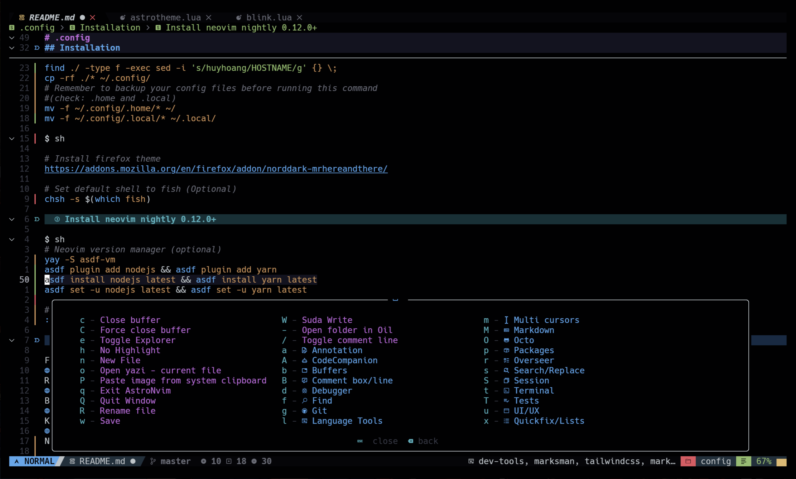

# .config

> [!IMPORTANT]
> Work in progress

## prerequisite

- Using arch based distro (endeavourOS)
- Install sway or hyprland from this setup
  - `yay -S hyprcursor hyprgraphics hypridle hyprland hyprland-qtutils hyprland-protocols hyprland-qt-support hyprlang hyprlock hyprpaper hyprpicker hyprpolkitagent hyprutils hyprwayland-scanner aquamarine`
  - Or `yay -S autotiling idlehack-git sway-contrib sway-git swaybg swayidle swaylock`

- Install other packages

```sh
yay -S bat bluetuith-bin kitty kvantum mpd mpv ncmpcpp rofi starship glow playerctl brightnessctl yazi asdf-vm uwsm xdg-desktop-portal xdg-desktop-portal-termfilechooser-boydaihungst-git xdg-desktop-portal-wlr libinput dunst waybar fish galculator github-cli git thunar shikane

# Manually install these packages
https://github.com/boydaihungst/org.freedesktop.FileManager1.common

# Optional
yay -S fcitx5 fcitx5-bamboo fcitx5-configtool fcitx5-gtk fcitx5-lua fcitx5-qt birdfont blender bottom calibre
```

## Installation

### Copy to ~/.config/ folder

```sh
rm -rf ~/config_tmp
git clone https://github.com/boydaihungst/.config config_tmp
cd config_tmp
# Change hostname (HOSTNAME) to whatever you want. eg: `/home/userA`-> HOSTNAME is `userA`
find ./ -type f -exec sed -i 's/huyhoang/HOSTNAME/g' {} \;
# This command will copy all files to ~/.config/, your config files will be replaced
# Remember to backup your home files ($HOME) before running these commands
cp -rf ./* ~/.config/
mv -f ~/.config/.home/* ~/
mv -f ~/.config/.local/* ~/.local/
```

```sh
# Install firefox theme
https://addons.mozilla.org/en/firefox/addon/norddark-mrhereandthere/

# Set default shell to fish (Optional)
chsh -s $(which fish)
```

### Install neovim nightly 0.12.0+

```sh
# Neovim version manager (optional)
yay -S asdf-vm
asdf plugin add nodejs && asdf plugin add yarn
asdf install nodejs latest && asdf install yarn latest
asdf set -u nodejs latest && asdf set -u yarn latest

# Open nvim and run command:
:AstroUpdate
```

### Alot of things need to be done manually

- Edit sway, hyprland
- Edit shikane
- Edit ~/.config/uwsm config files. uwsm/env-hyprland and uwsm/env-sway remove `AQ_DRM_DEVICES` and `WLR_DRM_DEVICES` env variables
- If you use laptop and hyprland:
  - Enable auto disable touchpad when mouse is detected:
    - Copy `~/.config/hypr/scripts/touchpad-toggle.sh` to `/usr/local/bin/touchpad-toggle.sh`, then change chmod: `chmod +x /usr/local/bin/touchpad-toggle.sh`
    - Copy `~/.config/udev/99-touchpad-toggle.rules` to `/etc/udev/rules.d/99-touchpad-toggle.rules`
    - Restart udev: `udevadm control --reload-rules && udevadm trigger`
- Enable services:
  - Enable `batsignal.service` if you use laptop: `systemctl enable --now --user batsignal.service`
  - Enable xdg-desktop-portal-termfilechooser.service and xdg-desktop-portal: `systemctl enable --now --user xdg-desktop-portal-termfilechooser.service xdg-desktop-portal.service`
- Etc

## Gallery

Firefox (tbh I prefer zen-browser with these zen mods [./.home/zen-mods-export.json](./.home/zen-mods-export.json))
Note: Set use-xdg-desktop-portal.location (and replace location with mime-handler, open-uri, file-picker) in `about:config` to `1`

Yazi
Note: You may need to edit `~/.config/yazi/yazi.toml` to remove some personal settings (like subtitle edit scripts, etc.)

Btop

Kitty

Nvim

Ncmpcpp

Calibre E-book viewer

Mpv

